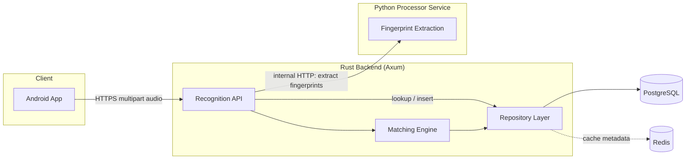
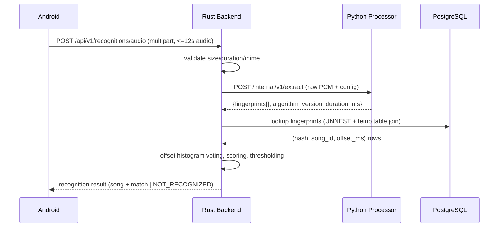

# Architecture

Loony Shazam is a Shazam-style audio recognition system built from three
independently deployable components that communicate over well-defined
network protocols:



## Component responsibilities

| Component | Owns | Does NOT own |
|---|---|---|
| Android | mic capture, permissions, UI, networking, local history (Room) | fingerprinting, matching |
| Rust backend | HTTP API, auth, validation, orchestration, DB access, matching/voting/ranking, caching, rate limiting, observability | DSP / spectrogram / peak detection |
| Python processor | audio decode, STFT, peak detection, constellation map, hash generation, ingestion DSP | HTTP routing, database schema, auth |

The Python processor is the **reference implementation** for the
fingerprinting algorithm — it must be deterministic given the same audio and
config. The Rust backend never re-implements DSP; it only consumes hashes
produced by the processor. This keeps the algorithm defined in exactly one
place, per [docs/fingerprinting.md](fingerprinting.md).

## Data flow (recognition path)



## Processor service internal protocol

The Rust backend never spawns a Python process per request. The processor
runs as a long-lived HTTP service (FastAPI + uvicorn) so process/model
startup cost is paid once.

`POST /internal/v1/extract`
```json
{
  "audio_base64": "...",       // or multipart, see api.md
  "content_type": "audio/wav",
  "algorithm_version": 1
}
```
Response:
```json
{
  "algorithm_version": 1,
  "sample_rate": 11025,
  "duration_ms": 8000,
  "fingerprints": [
    {"hash": 3489201, "offset_ms": 120},
    {"hash": 9182734, "offset_ms": 132}
  ]
}
```

`GET /internal/v1/health` — liveness.
`GET /internal/v1/algorithm` — reports current `algorithm_version` and config
fingerprint (sample rate, fft size, hop size) so the Rust backend can detect
a mismatch between the running processor and the catalog it is about to
query.

The backend calls this service using a pooled `reqwest::Client` with a
strict timeout (`PROCESSOR_TIMEOUT_MS`) and treats a processor failure as a
`502`-class error distinct from "no match found".

## Fingerprint hash format

See [docs/fingerprinting.md](fingerprinting.md) for full derivation. Summary:

A fingerprint hash is a 32-bit unsigned integer:

```
bit:   31        28 27        18 17         8 7           0
      [ version:4 ][ anchor_f:10 ][ target_f:10 ][ delta_t:8 ]
```

- `version` (4 bits): `FINGERPRINT_ALGORITHM_VERSION`, currently `1`.
- `anchor_f` / `target_f` (10 bits each): quantized FFT bin index of the
  anchor and target peak, restricted to the analysis band (40–5000 Hz).
- `delta_t` (8 bits): quantized frame delta between anchor and target,
  clamped to the target-zone window (0–255 STFT hops).

Stored alongside each hash: `song_id`, `offset_ms` (the anchor's absolute
time in the reference track). The hash is stored as a `BIGINT` (i64) in
Postgres to keep arithmetic simple and support future bit-width growth
without a column type change.

## Database design

See [docs/database.md](database.md) for full schema and scaling notes.
Core tables: `songs`, `fingerprints` (hash, song_id, offset_ms,
algorithm_version), plus `recognitions` (audit/history, optional) and
`ingested_sources` (idempotency by file SHA-256).

`fingerprints` is the hot table and is expected to hold hundreds of millions
of rows at catalog scale. It is designed for `COPY`-based bulk insert and a
composite B-tree index on `(hash, algorithm_version)` for the lookup path.

## Matching engine

Implemented entirely in Rust (`backend/src/matching`). Given the set of
query fingerprints:

1. Bulk lookup via a single query using `UNNEST($1::bigint[])` joined
   against `fingerprints` — no per-hash round trips, no giant `IN (...)`
   list.
2. For every matching row, compute `offset = reference_offset_ms -
   query_offset_ms`, quantize into `offset_bucket_ms` (default 100ms)
   buckets, and vote per `(song_id, bucket)`.
3. Build a per-song histogram; the dominant bucket's vote count is the
   `dominant_votes` signal.
3. Score candidates using dominant votes, total votes, unique query hashes
   matched, and query coverage (see fingerprinting.md §Scoring).
4. Apply configurable thresholds; below threshold → `NOT_RECOGNIZED`.

The lookup is behind a small `FingerprintIndex` trait so the storage
backend (plain Postgres today) can be swapped later (e.g. a dedicated
inverted-index service) without touching the ranking logic.

## Android architecture

- Single Activity, Jetpack Compose navigation (`Navigation Compose`).
- `AudioRecorder` wraps `AudioRecord` behind a coroutine `Flow`, producing
  PCM16 chunks; recording is capped at `MAX_RECORDING_SECONDS` (12s).
- `RecognitionRepository` encodes captured PCM as WAV and uploads via
  Retrofit/OkHttp to `POST /api/v1/recognitions/audio`.
- `RecognitionViewModel` drives a state machine:
  `Idle -> Listening -> Processing -> Result | NotFound | Error`.
- `HistoryDatabase` (Room) persists recognition results locally; no
  raw audio is ever persisted.

## Deployment topology (docker-compose)

`postgres`, `redis`, `processor`, `backend` — backend depends on processor
and postgres being healthy (Docker healthchecks + `depends_on: condition:
service_healthy`). Android is a separate, unmanaged client pointed at the
backend's base URL via build config.

## Key tradeoffs and decisions

- **Sample rate 11025 Hz / mono / float32 internally.** Halves FFT cost vs.
  22050/44100 while retaining the 40–5000 Hz band where most musically
  distinctive energy and human-audible landmark structure lives (this is
  the same choice made by the original Shazam paper, Wang 2003).
- **Rust never reimplements DSP.** A network hop to the processor costs
  low-single-digit milliseconds on localhost/Docker-bridge and is paid once
  per recognition; the alternative (two independently-maintained
  fingerprinting implementations that must stay bit-identical) is a much
  larger long-term risk.
- **Hash encodes the algorithm version in its top 4 bits** in addition to a
  separate `algorithm_version` column, so raw hash collisions across
  versions are structurally impossible even if a query ever mixed rows.
- **COPY-based bulk insert, not row-by-row INSERT**, for ingestion — this is
  the only way `fingerprints` scales into the hundreds of millions of rows.
- **UNNEST-based batched lookup, not per-hash queries or giant IN lists**,
  keeps the recognition query a single round trip.
