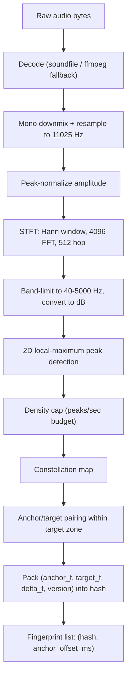
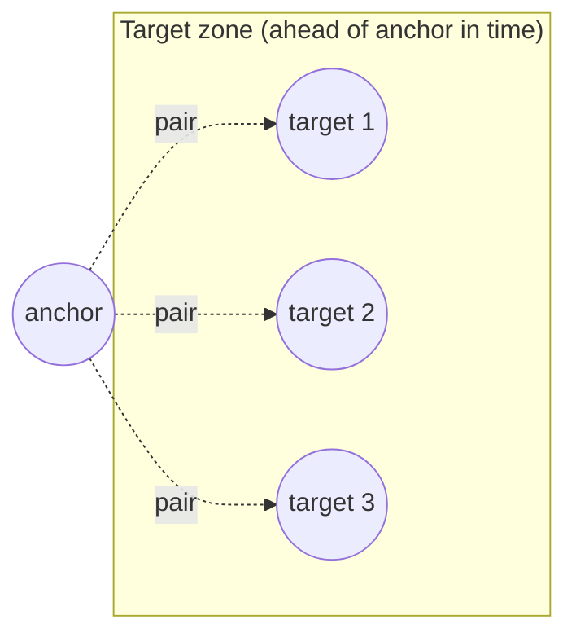
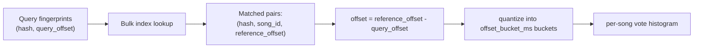

# Audio Fingerprinting Algorithm

This document explains the Shazam-style landmark-hashing algorithm
implemented in [`processor/src/music_fingerprint`](../processor/src/music_fingerprint)
(the reference implementation) and consumed by the Rust matching engine in
[`backend/src/matching`](../backend/src/matching). Parameter defaults live
in [`processor/src/music_fingerprint/config.py`](../processor/src/music_fingerprint/config.py),
each documented inline with why it was chosen.

## Pipeline overview



## 1. Normalization (`audio.py`)

All audio — reference or query — is converted to one canonical
representation before anything else happens:

- **Mono**: multi-channel audio is averaged down to one channel.
- **Resampled to 11025 Hz** via polyphase resampling (`scipy.signal.resample_poly`),
  a quarter of the common 44.1kHz consumer rate. This halves FFT cost
  relative to 22050Hz while keeping the Nyquist frequency (~5.5kHz)
  comfortably above the 40–5000Hz analysis band. This matches the sample
  rate used in the original Shazam paper (Wang, 2003).
- **Peak-normalized** to a consistent amplitude so the dB-based thresholds
  in peak detection behave consistently regardless of the source
  recording's mastering loudness.

Untrusted input handling: payload size and decoded duration are checked
against configurable limits (`AudioTooLargeError`, `AudioTooLongError`),
zero-length audio raises `AudioEmptyError`, and anything libsndfile can't
decode falls back to an `ffmpeg` subprocess (invoked with an explicit argv
list, never a shell string) before failing with `AudioDecodeError`.

## 2. Spectrogram (`spectrogram.py`)

A magnitude spectrogram is computed via STFT (`scipy.signal.stft`) with:

- **FFT size 4096** (~371ms window, ~2.69Hz bin resolution at 11025Hz)
- **Hop size 512** (~46.4ms, 87.5% overlap) — enough time resolution that a
  landmark's time bin survives realistic mic-latency/playback jitter
  without shifting by more than one offset-histogram bucket
- **Hann window** — smooth spectral leakage rolloff
- No implicit padding (`boundary=None, padded=False`): frame `i` covers
  exactly samples `[i*hop, i*hop + fft_size)`, so timing is exact and
  reproducible.

The result is band-limited to 40–5000Hz (see config.py rationale — this is
where distinctive, mic/codec-durable musical energy lives) and converted to
dB: `20 * log10(max(magnitude, epsilon))`.

## 3. Peak detection (`peaks.py`)

A bin is kept as a **peak** (a "landmark") iff all three hold:

1. **Local maximum**: it is the strongest bin within a `(freq_bins,
   time_bins)` neighborhood window (`scipy.ndimage.maximum_filter`).
2. **Local contrast**: it exceeds the neighborhood's local mean by at
   least `peak_min_db_above_local_mean` dB — this adapts to locally
   loud/quiet passages instead of using one global threshold.
3. **Absolute floor**: it exceeds `peak_absolute_floor_db` relative to the
   track's own peak level, so near-silence can't produce peaks from
   numerical noise.

Peak count is then capped at `max_peaks_per_second` (ranked by amplitude),
protecting against pathological density from white noise, clipping, or
adversarial input.

### Why the neighborhood/threshold values are what they are

The defaults (`peak_neighborhood_freq=9`, `peak_neighborhood_time=25`,
`peak_min_db_above_local_mean=14.0`) were **not** guessed — they came
from an empirical sweep documented in [performance.md](performance.md) and
summarized in `config.py`. The first pass used weaker values
(neighborhood 15×15, 6dB contrast) and, under synthetic additive white
noise, peak/fingerprint counts inflated roughly 7× and the offset-histogram
vote margin between the correct answer and noise collapsed to near zero.
Raising the contrast threshold to 14dB and using an asymmetric neighborhood
(narrower in frequency to preserve pitch resolution, wider in time to
suppress redundant peaks from one sustained note) restored a >5× vote
margin at the same noise level. This is exactly the kind of tuning the
product spec asks for — parameters chosen and justified by measurement, not
intuition.

## 4. Constellation map (`constellation.py`)

The filtered, sorted (by time then frequency) peak list *is* the
constellation map — a sparse, deterministic set of `(time_bin,
frequency_bin, amplitude)` points. No machine learning, no probabilistic
component: identical input audio and config always produce an identical
constellation.

## 5. Landmark generation (`fingerprint.py`)

For every peak (the **anchor**), pair it with up to `fanout` (default 5)
subsequent peaks (**targets**) whose time offset from the anchor falls
inside `[target_zone_min_frames, target_zone_max_frames]` (default `[1,
100]` frames, ≈46ms–4.6s). This is the classic "target zone" from Wang
2003: a rectangle ahead of the anchor in time.



Each `(anchor, target)` pair produces one fingerprint:
`hash(anchor_freq, target_freq, delta_t)`, stored alongside the anchor's
absolute offset into the track (`offset_ms`).

Bounding `fanout` and the target-zone window keeps fingerprint generation
linear in the number of peaks (not quadratic), which is what protects
ingestion against pathologically dense/noisy/adversarial audio.

## 6. Hash format (`hashing.py`)

A fingerprint hash is a packed **32-bit unsigned integer**:

```
bit:   31        28 27        18 17         8 7           0
      [ version:4 ][ anchor_f:10 ][ target_f:10 ][ delta_t:8 ]
```

- **`version`** (4 bits) — `FINGERPRINT_ALGORITHM_VERSION`, currently `1`.
  Encoded directly into the hash *and* stored as a separate
  `algorithm_version` column, so hashes from an incompatible algorithm
  revision can never silently collide or be compared, even if a query
  somehow mixed rows from two versions.
- **`anchor_f` / `target_f`** (10 bits each, 0–1023) — the anchor/target
  peak's FFT bin, quantized via integer math (`(bin - min_bin) *
  1023 // (max_bin - min_bin)`, no floating-point rounding drift) across
  the analysis band.
- **`delta_t`** (8 bits, 0–255) — the frame distance between anchor and
  target, clamped to fit; `target_zone_max_frames` (100) is chosen to stay
  well under this ceiling.

The packed value fits in an i64 Postgres `BIGINT` with headroom to widen
the format later without a schema change (see `database/migrations/0002_fingerprints.sql`).

**Collision behavior**: quantizing 10 bits of frequency across roughly
1800 raw FFT bins in the analysis band means adjacent bins can map to the
same quantized value — this is intentional lossy compression that trades a
small amount of frequency precision for hash compactness and query-time
tolerance to tiny frequency jitter (pitch drift from resampling, minor
codec artifacts). Collisions between *unrelated* songs are handled by the
matching engine's temporal-consistency requirement (§ below), not by
trying to make individual hashes unique.

**Versioning**: if the algorithm changes in a way that would produce
different hashes for the same audio, `FINGERPRINT_ALGORITHM_VERSION` must
be bumped. The backend explicitly checks that a processor's reported
version matches its own configured expectation
(`AppError::AlgorithmVersionMismatch`) before trusting a lookup result.

## 7. Storage and lookup

See [database.md](database.md) for the schema. The recognition-time query
is a single batched lookup:

```sql
SELECT f.hash, f.song_id, f.offset_ms
FROM fingerprints f
INNER JOIN UNNEST($1::bigint[]) AS q(hash) ON f.hash = q.hash
WHERE f.algorithm_version = $2
```

— never a per-hash query or a giant `IN (...)` list (see
[architecture.md](architecture.md) "Search optimization").

## 8. Temporal offset voting (`backend/src/matching/voting.rs`)

Matching raw hashes is not enough on its own — two songs can share
individual landmark hashes by chance, especially as a catalog grows. The
signal that actually identifies a song is **temporal consistency**: if the
query really is a clip of a given reference track, *every* matched
landmark should agree on the same time offset between query and reference.



For every matched `(query_hash, reference_hash)` pair, compute `offset =
reference_offset_ms - query_offset_ms`, quantize into a
`MATCH_OFFSET_BUCKET_MS`-wide bucket (default 100ms — wide enough to
absorb mic latency, frame-grid misalignment between independently-computed
query/reference STFTs, and small clock drift, narrow enough to keep a real
match's votes concentrated), and cast one vote for `(song_id, bucket)`.

A song whose query really matches accumulates most of its votes in one
**dominant bucket**. An unrelated or coincidental partial match spreads
votes thinly across many buckets.

## 9. Scoring (`backend/src/matching/scoring.rs`)

For each candidate song:

- **`dominant_votes`** — vote count of the single largest bucket.
- **`concentration`** = `dominant_votes / total_votes` — what fraction of
  this song's votes agree on one offset. Close to 1.0 for a real match;
  low for a coincidental one.
- **`coverage`** = distinct query hashes matched in the dominant bucket ÷
  total query fingerprints — how much of the query itself is "explained"
  by this song at one consistent offset.
- **`score`** = `dominant_votes * concentration` — the ranking heuristic
  used to order candidates and check `MATCH_MIN_SCORE`. This deliberately
  rewards *both* raw vote count and consistency: a candidate with 50
  dominant votes out of 200 total (concentration 0.25, mostly noise) scores
  12.5, while 50 dominant out of 55 total (concentration 0.91, a real
  match) scores 45.5.
- **`confidence`** = `dominant_votes / query_fingerprint_count`, clamped to
  `[0, 1]`.

**`confidence` and `score` are heuristics, not calibrated probabilities.**
They have not been validated against a labeled real-world query corpus
(microphone recordings across devices/environments) — that calibration
work is listed as a follow-up in [performance.md](performance.md). The API
never claims "99.9% confidence"; it reports these values as-is and
documents their meaning here.

## 10. Thresholds and "not recognized" (`backend/src/matching/engine.rs`)

A candidate is only returned as a match if **all** of the following hold
(all configurable via environment variables, see `.env.example`):

| Check | Config | Default | Rejection reason |
|---|---|---|---|
| Enough raw votes | `MATCH_MIN_DOMINANT_VOTES` | 5 | `InsufficientVotes` |
| Ranking score high enough | `MATCH_MIN_SCORE` | 4.0 | `BelowScoreThreshold` |
| Enough of the query explained | `MATCH_MIN_COVERAGE` | 0.03 | `BelowCoverageThreshold` |
| Clearly better than runner-up | `MATCH_MIN_MARGIN_RATIO` | 1.3× | `AmbiguousMargin` |

If the query produced zero fingerprints (e.g. near-silence) or zero index
hits at all, the result is `NoQueryFingerprints` / `NoCandidates`. Every
rejection reason is tracked internally (for metrics/logs — see
`RecognitionReason::as_metric_label`) but the public API only ever reports
a single `"NO_MATCH"` string, per the product spec: **the system never
forces a match**.

## Evaluation

`processor/tests/test_integration_recognition.py` builds a small reference
catalog from synthetic audio and verifies recognition survives: volume
reduction, additive noise (std 0.2 against a peak-normalized signal),
silence padding before/after, a different starting offset, and real MP3
128kbps compression (round-tripped through `ffmpeg`) — while confirming
unrelated audio is correctly rejected. See
[performance.md](performance.md) for the noise-level tuning data.
