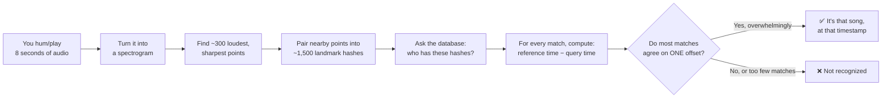
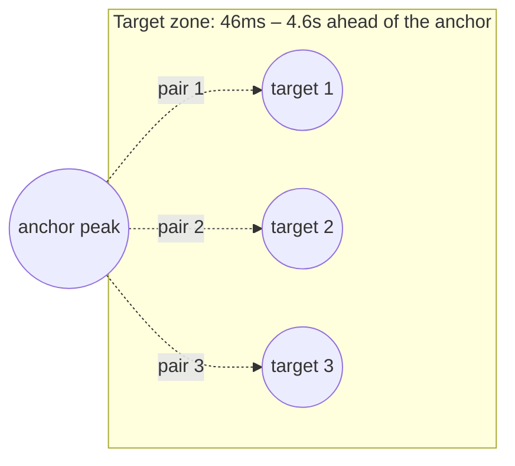
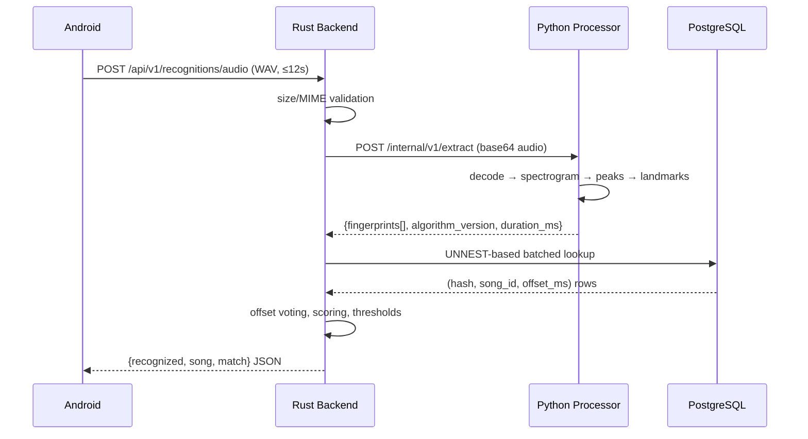

# How Song Recognition Works — The Complete Guide

*A from-first-principles walkthrough of everything that happens between a
person tapping a microphone button and a song title appearing on their
screen — the physics, the math, the algorithm, the code, and the real bugs
that shaped the design. This is the long-form companion to the other docs
in this folder; where they're reference material, this is the story.*

> If you only read one paragraph, read this one: this system does **not**
> compare sounds the way you'd compare two photos pixel-by-pixel. It turns
> each song into tens of thousands of tiny, precise numbers — "at this
> exact moment, these two frequencies occurred this far apart" — throws
> away everything else, and then asks a database "which song has the most
> of *these specific numbers*, all agreeing on the same time offset?" That
> one idea — landmark hashing plus temporal voting — is the entire trick,
> and everything below is either building up to it or building on top of
> it.

---

## Table of contents

- [Part 0 — The 60-second version](#part-0--the-60-second-version)
- [Part I — What audio actually is](#part-i--what-audio-actually-is)
- [Part II — From a wiggly line to a spectrum](#part-ii--from-a-wiggly-line-to-a-spectrum)
- [Part III — The spectrogram: watching frequency over time](#part-iii--the-spectrogram-watching-frequency-over-time)
- [Part IV — Constellations: keeping only what matters](#part-iv--constellations-keeping-only-what-matters)
- [Part V — Landmark hashing: the actual Shazam trick](#part-v--landmark-hashing-the-actual-shazam-trick)
- [Part VI — Packing a landmark into 32 bits](#part-vi--packing-a-landmark-into-32-bits)
- [Part VII — Storing millions of these things](#part-vii--storing-millions-of-these-things)
- [Part VIII — The matching engine: from "some numbers matched" to "it's this song"](#part-viii--the-matching-engine-from-some-numbers-matched-to-its-this-song)
- [Part IX — A real worked example, start to finish](#part-ix--a-real-worked-example-start-to-finish)
- [Part X — The three programs that make this work](#part-x--the-three-programs-that-make-this-work)
- [Part XI — The Android app: asking the question](#part-xi--the-android-app-asking-the-question)
- [Part XII — The Rust backend: answering it](#part-xii--the-rust-backend-answering-it)
- [Part XIII — The Python processor: doing the DSP](#part-xiii--the-python-processor-doing-the-dsp)
- [Part XIV — Building the library: ingestion](#part-xiv--building-the-library-ingestion)
- [Part XV — Five real bugs and what they taught us](#part-xv--five-real-bugs-and-what-they-taught-us)
- [Part XVI — What "confidence" does and doesn't mean](#part-xvi--what-confidence-does-and-doesnt-mean)
- [Part XVII — Running it yourself](#part-xvii--running-it-yourself)
- [Glossary](#glossary)
- [Further reading](#further-reading)

---

## Part 0 — The 60-second version



Every catalog song goes through steps B–D once, in advance, at ingestion
time, and the results sit in a database. Every *query* clip goes through
the same B–D at request time, then E–H happens live. The rest of this
document is what's actually inside each of those boxes.

---

## Part I — What audio actually is

Sound is air pressure changing over time. A microphone converts that
pressure wave into a voltage that changes over time, and an
analog-to-digital converter (ADC) turns that voltage into a sequence of
numbers by measuring it at regular intervals. That's it — that's a
recording. Zoom in far enough on any WAV file and you'll find nothing more
mysterious than a list of numbers like `[0.02, 0.05, 0.03, -0.01, ...]`,
one every fraction of a millisecond, each one an amplitude sample.

Three numbers describe any such recording:

- **Sample rate** — how many measurements per second. CD audio uses
  44,100 (44.1kHz). Our pipeline works at **11,025Hz** — a deliberate,
  documented choice explained in Part III.
- **Bit depth** — how precisely each measurement is stored. 16-bit
  integers (CD quality) give 65,536 possible amplitude values.
  Internally, once decoded, this system works in 32-bit floating point
  for headroom and precision during processing.
- **Channels** — 1 (mono) or 2+ (stereo/surround). Recognition doesn't
  care about stereo imaging, so the very first thing that happens to any
  audio — reference or query — is averaging all channels down to one
  (`processor/src/music_fingerprint/audio.py`, `_to_mono`).

### Why you can't just compare the numbers directly

The tempting naive idea: store every song's raw sample sequence, and when
a query comes in, slide it against every stored song looking for a match
(like `Ctrl+F` for audio). This fails immediately and completely for
real-world recognition, for reasons worth understanding because they
motivate everything that follows:

1. **A microphone recording is never bit-identical to the original.**
   Room acoustics, the phone's mic frequency response, ambient noise, and
   the speaker it's playing through all distort the waveform. Two
   recordings of the same physical performance can differ in *every
   single sample* while still being "the same song" to a human ear.
2. **It doesn't scale.** Comparing a query against N reference songs
   sample-by-sample is `O(N × samples)` — with a catalog of thousands of
   songs at CD quality, that's billions of comparisons per query.
3. **You don't know the offset.** The query is a random 8-second slice
   from somewhere inside a 4-minute song. You'd have to try aligning it
   at every possible starting position, multiplying the cost further.

The fix for problem 1 is to stop looking at the waveform directly and look
at *structure* that survives noise and distortion — which is what the
frequency domain gives us (Parts II–III). The fix for problems 2 and 3 is
to turn "compare everything" into "look up a small number of exact
values" — a job databases are extremely good at — which is what landmark
hashing gives us (Part V) and temporal voting gives us for free as a side
effect (Part VIII).

---

## Part II — From a wiggly line to a spectrum

### The core insight: any sound is a sum of pure tones

A cornerstone of signal processing (going back to Joseph Fourier in 1822)
is that any repeating waveform, no matter how complex, can be built by
adding together simple sine waves of different frequencies, amplitudes,
and phases. A violin note isn't "one frequency" — it's a fundamental
frequency plus a specific recipe of quieter harmonics on top, and that
exact recipe is what makes a violin sound different from a flute playing
the same pitch.

The **Fourier Transform** is the mathematical operation that takes a
waveform (amplitude over time) and answers: "how much of each possible
frequency is present in this signal?" It converts a *time-domain* signal
into a *frequency-domain* one. Conceptually:

```
time domain:      "here's the amplitude at every instant"
                            ↓ Fourier Transform
frequency domain: "here's how much energy is at every frequency"
```

This matters for recognition because **frequency content is much more
robust to noise and distortion than the raw waveform is.** Background
chatter, a slightly different microphone, MP3 compression — these all
perturb the waveform a lot, but the *dominant* frequencies present in a
song at a given moment tend to survive. That robustness is the entire
reason this system operates on spectra, not waveforms.

### The catch: a single Fourier Transform loses "when"

A plain Fourier Transform on an entire song answers "what frequencies
occurred, in total, somewhere in this recording" — but throws away *when*
each frequency happened. For music recognition, timing is essential (a
song is a specific sequence of notes, not a bag of pitches). The fix is
the **Short-Time Fourier Transform (STFT)**: chop the audio into many
small overlapping windows, and run a separate Fourier Transform on each
window. The result is a sequence of spectra over time — which is exactly
a **spectrogram**, covered next.

---

## Part III — The spectrogram: watching frequency over time

`processor/src/music_fingerprint/spectrogram.py` computes this. The
parameters, and why each one has its specific value, are worth walking
through in full because every one of them is a deliberate tradeoff, not a
default left untouched:

| Parameter | Value | Why |
|---|---|---|
| Sample rate | 11,025 Hz | A quarter of the common 44.1kHz consumer rate. Nyquist–Shannon sampling theorem: a digital signal sampled at rate *R* can only represent frequencies up to *R*/2 (the "Nyquist frequency"). At 11,025Hz that ceiling is ~5,512Hz — comfortably above the 40–5,000Hz band where musically distinctive, mic/codec-durable energy lives (see below), while roughly **halving** the cost of every FFT compared to 22,050Hz, with no measurable loss in recognition quality for music. This is the same rate the original 2003 Shazam paper (Avery Wang) uses. |
| FFT window size | 4,096 samples (~371ms) | Long enough to resolve fine frequency detail (bin width ≈ 2.69Hz — see the math below), short enough that a transient (a drum hit, a note onset) is still localized in time rather than smeared across a huge window. |
| Hop size | 512 samples (~46ms) | How far the window slides between frames — an 87.5% overlap. Short hops mean a landmark's *time* is measured precisely enough to survive ~50ms of playback jitter or mic latency without its time-bucket shifting. |
| Window function | Hann window | A smooth taper applied to each frame before the FFT, so the abrupt edges of a finite chunk of audio don't create fake high-frequency "ringing" artifacts (spectral leakage) that would masquerade as real signal. |

**The frequency resolution math**, because it explains a number you'll
see again in Part VI: with a sample rate of 11,025Hz and an FFT size of
4,096, each output "bin" of the FFT represents a frequency band of width

```
freq_bin_hz = sample_rate / fft_size = 11025 / 4096 ≈ 2.69 Hz
```

So FFT bin 0 is 0Hz, bin 1 is ~2.69Hz, bin 2 is ~5.38Hz, and so on, up to
bin 2048 at the Nyquist frequency (~5,512Hz).

### Restricting to the 40–5,000Hz band

Not every frequency bin is useful. Below 40Hz is sub-bass rarely present
or musically distinctive in consumer recordings (often just rumble/DC
offset). Above 5,000Hz, phone speakers and laptop microphones roll off
heavily, and lossy compression (MP3, AAC) is specifically designed to
discard high frequencies first since human hearing is less sensitive
there — so energy up there is the *least* likely to survive the whole
"play a song out loud, record it with a phone" journey. Restricting to
this band both saves computation and — more importantly — keeps only the
frequency content that's actually stable across real-world distortion.

In bin terms: `min_freq_bin = 40 / 2.69 ≈ 15`, `max_freq_bin = 5000 / 2.69
≈ 1858`. Everything downstream only ever looks at bins 15–1858.

### Turning magnitude into decibels

The FFT of a windowed frame produces complex numbers; taking their
absolute value gives a **magnitude** — how much energy is at that
frequency in that time window. Raw magnitudes span an enormous range (a
loud drum hit can be 1,000x the magnitude of a quiet background hum), and
human perception of loudness is itself roughly logarithmic. So every
magnitude is converted to decibels: `20 * log10(magnitude)`, compressing
that huge range into something peak-detection thresholds (Part IV) can
work with sensibly, expressed as "N dB louder than its surroundings"
rather than "N times the amplitude."

The complete output of this stage — a 2D grid of dB values, one axis
frequency, one axis time — *is* the spectrogram. If you've ever seen one
rendered as an image (the kind you see in audio editing software, with
brighter colors for louder frequencies), that image is a direct
visualization of this exact array.

---

## Part IV — Constellations: keeping only what matters

A spectrogram for an 8-second clip at these settings is roughly 1,844
frequency bins × ~170 time frames — over 300,000 numbers. Nearly all of
that is redundant or noisy: sustained notes repeat the same energy across
many adjacent time frames, and quiet background texture fills space
without carrying identity. `processor/src/music_fingerprint/peaks.py`
reduces this to a sparse set of **peaks** — the loudest, sharpest,
most-isolated points — typically only a few hundred per clip. This sparse
set is called the **constellation map**, because plotted on a
time-vs-frequency graph it looks exactly like a star chart: scattered
points against a black background.

A spectrogram bin survives as a peak only if **all three** of these hold:

1. **Local maximum.** It must be the single loudest bin within a
   neighborhood window around it — 9 frequency bins wide (~24Hz) by 25
   time frames wide (~1.16s). This window is deliberately *asymmetric*:
   narrow in frequency (so two musically-close pitches aren't merged into
   one blob) and wide in time (so a single sustained note doesn't
   generate a redundant peak every single frame it rings out).
2. **Local contrast.** It must exceed the *average* loudness of that same
   neighborhood by at least **14dB**. This is what makes a peak a peak
   rather than just "loud" — it has to stand out from its immediate
   surroundings, not merely be loud in an already-loud passage. (Part XV
   tells the story of why this is 14dB and not the original guess of 6dB,
   and why it's a *mean* rather than a literal *median*.)
3. **Absolute floor.** It must be within 60dB of the track's own loudest
   moment. This exists purely so that near-silence — where numerical
   noise floor bins can look locally "sharp" relative to an even quieter
   neighborhood — never generates spurious peaks.

Finally, **density is capped** at 60 peaks per second of audio, keeping
only the strongest ones if more survive the filters above. This is a
deliberate abuse/robustness guard: white noise, clipped audio, or a
maliciously crafted file can be locally "peaky" almost everywhere, and
without a cap that would generate an unbounded, resource-exhausting
number of landmarks downstream. It's also just good hygiene — a real
song's genuinely distinctive moments are a small, bounded fraction of its
duration.

The output of this stage is a plain list of `(time, frequency, loudness)`
triples — deterministic, reproducible, no machine learning or randomness
anywhere in the pipeline. Identical input audio always produces the
identical constellation, byte for byte (verified by a golden-fixture test
in `processor/tests/test_fingerprint.py`).

---

## Part V — Landmark hashing: the actual Shazam trick

Here's the problem a constellation map alone doesn't solve: a single
isolated peak — "there was energy at 440Hz around the 3.2 second mark" —
is a terrible fingerprint. Thousands of songs have *some* moment near
440Hz. A single peak carries almost no distinguishing information, and
matching on single peaks alone would return every song in the catalog as
a "match" for nearly any query.

The insight that makes Shazam-style recognition actually work (Avery
Wang's 2003 paper, cited in [Further reading](#further-reading)) is:
**don't hash single peaks — hash *pairs* of peaks.** Specifically, for
every peak (call it the **anchor**), look at nearby peaks that occur
*shortly after it in time* (called **targets**, inside a "target zone"),
and create one landmark for each anchor/target pair:

```
landmark = hash(anchor_frequency, target_frequency, time_gap_between_them)
```

Why does pairing help so dramatically? Because `(this exact frequency,
that exact frequency, this exact time gap)` is a combinatorially much
rarer event than either frequency alone. If frequency alone gives you,
say, 1-in-1,000 specificity, a *pair* with a specific time gap gives you
something closer to 1-in-several-million — while still being a small,
fixed-size number that's cheap to compute and index. It's the audio
equivalent of the difference between searching for someone using "brown
hair" (matches millions of people) versus "brown hair, born within three
minutes of this exact timestamp, at this exact hospital" (matches almost
no one) — pairing two independently-common facts with their precise
relationship turns a weak signal into a strong one.

`processor/src/music_fingerprint/fingerprint.py` implements this pairing:
for each anchor peak, it walks forward through the (time-sorted)
constellation and pairs it with up to **5** subsequent peaks (the
*fanout*) whose time gap falls between roughly 46ms and 4.6 seconds later
(1 to 100 STFT frames — the *target zone*). Both numbers are bounded on
purpose: fanout keeps the number of landmarks generated per peak constant
(so a dense, noisy passage can't explode into a quadratic number of
pairs), and the target-zone ceiling exists specifically so the time gap
still fits comfortably in the 8 bits allotted to it in the hash (Part
VI) — 100 frames is well under the 8-bit ceiling of 255.



Every one of these pairs becomes one **landmark**: a hash value, plus the
anchor's absolute timestamp in the track. A typical 8-second query
produces on the order of 250–300 landmarks; a full 4-minute song produces
several thousand. This list of `(hash, timestamp)` pairs is the complete
"fingerprint" of a piece of audio — everything downstream (storage,
matching) operates purely on this list, never touching raw audio again.

---

## Part VI — Packing a landmark into 32 bits

`processor/src/music_fingerprint/hashing.py` turns each `(anchor
frequency, target frequency, time gap)` triple into a single, compact,
32-bit unsigned integer with this exact bit layout:

```
bit:   31        28 27        18 17         8 7           0
      [ version:4 ][ anchor_f:10 ][ target_f:10 ][ delta_t:8 ]
```

Reading it field by field:

- **`version` (4 bits, values 0–15).** Which revision of the fingerprint
  algorithm produced this hash. Currently `1`. This is encoded directly
  into the hash *and* stored again as a separate database column, so
  fingerprints from an incompatible future algorithm revision can never
  silently collide with today's or be compared against them — the Rust
  backend explicitly checks the processor's reported version against its
  own expectation before trusting any lookup result
  (`AppError::AlgorithmVersionMismatch`).
- **`anchor_f` / `target_f` (10 bits each, 0–1023).** The anchor and
  target peak's frequency, but not the raw FFT bin number (which ranges
  up to ~1858, too big for 10 bits) — instead, a *quantized* position
  within the 40–5,000Hz band, computed with pure integer math:
  `quantized = (bin − min_bin) × 1023 ÷ (max_bin − min_bin)`. No floating
  point anywhere in this calculation, so there's zero risk of rounding
  drift producing a different hash on different hardware or Python
  versions — determinism is a hard requirement here.
- **`delta_t` (8 bits, 0–255).** The number of STFT frames between anchor
  and target, clamped to fit. Since the target zone tops out at 100
  frames, this field never actually needs to clamp in practice — the 8-bit
  width was chosen with headroom.

Two things worth calling out explicitly:

**This is lossy compression, on purpose.** Quantizing ~1,844 raw
frequency bins down to 1,024 quantized values means some adjacent bins
map to the same quantized value. That's not a bug to fix — it's
deliberate tolerance for exactly the kind of tiny frequency jitter that
resampling, mic hardware, or codec artifacts introduce, so a query
recorded through imperfect equipment still lands on the *same* quantized
value as the clean reference. Perfect precision would make the whole
system brittle instead of robust.

**Collisions between unrelated songs are expected and handled elsewhere,
not avoided here.** With a 24-bit useful space (10+10+... realistically
somewhat less after quantization overlap) shared across a large catalog,
two completely different songs will occasionally produce the exact same
hash value by pure chance. The hash format doesn't try to prevent this —
it's the **temporal voting** step (Part VIII) that makes coincidental
single-hash collisions harmless, because a real match needs *many*
landmarks to agree on the same time offset simultaneously, which random
collisions essentially never do.

The packed value fits comfortably in a 32-bit space but is stored as a
64-bit `BIGINT` in Postgres — deliberate headroom to widen the format
later (e.g. more frequency precision, or a longer target zone) without an
incompatible schema change.

---

## Part VII — Storing millions of these things

A single song produces thousands of landmarks; a real catalog produces
millions to billions. `database/migrations/0002_fingerprints.sql` is
designed around that scale from day one, in ways that would be
overkill for a toy project but are exactly right here:

- **No surrogate primary key.** Most tables get an auto-incrementing `id`
  column by convention. This one deliberately doesn't — at catalog scale,
  a redundant identity column (and the index that comes with it) costs
  real disk and memory for zero query benefit, since nothing ever needs
  to reference an individual fingerprint row by its own identity.
- **One covering index that does all the work:** a B-tree on `(hash,
  algorithm_version)` that *includes* `song_id` and `offset_ms` as extra
  payload columns. This lets Postgres answer the entire hot-path query —
  "which songs and offsets have this hash?" — directly from the index
  itself, an *index-only scan*, without ever touching the underlying
  table row. This is the single most important performance decision in
  the whole storage layer.
- **Bulk `COPY`, never row-by-row `INSERT`, for loading.** Postgres's
  `COPY ... FROM STDIN` is a streaming bulk-load path, dramatically faster
  than issuing millions of individual `INSERT` statements — the
  difference between an ingestion run measured in minutes versus hours at
  real catalog scale. Part XIV covers ingestion in full; the key point
  here is that the schema and the loading strategy were designed together.

The catalog scaling story documented in `docs/database.md`: this exact
schema, unpartitioned, comfortably serves 10 to roughly 1,000 songs; from
there to 100,000+ songs the documented next step is `LIST`-partitioning
the table by `algorithm_version` (there are only ever a handful of live
versions at once) — an additive migration, not a rewrite, because nothing
in the application code assumes an unpartitioned table.

---

## Part VIII — The matching engine: from "some numbers matched" to "it's this song"

This is the part of the system most people get wrong on a first attempt,
and it's worth spelling out exactly why the *naive* approach fails before
explaining the real one.

### The wrong way: just count matching hashes

Imagine simply asking: "for each song in the catalog, how many of the
query's landmark hashes also appear somewhere in that song?" and picking
the song with the highest count. This sounds reasonable but breaks down
in practice for a specific, important reason: **a popular chord
progression, a common drum pattern, or simple statistical noise across a
large catalog will produce scattered hash overlaps with dozens of
unrelated songs.** A raw match count can't distinguish "this song shares
50 landmarks with the query, all clustered around one specific moment"
(a real match) from "this song shares 50 landmarks with the query,
scattered randomly across its entire four minutes" (coincidence, or a
large catalog's background noise). Both look identical to a plain counter.

### The right way: temporal offset voting

The actual signal that identifies a song isn't *how many* hashes match —
it's whether the matches **agree on when**. Here's the reasoning: if a
query clip genuinely is 8 seconds cut from the middle of a specific
reference song, then for every landmark that matches, the relationship

```
offset = (landmark's timestamp in the reference song) − (landmark's timestamp in the query clip)
```

should come out to **the same value**, every time — namely, wherever in
the reference track that 8-second clip started. A landmark at 2.1 seconds
into the query that matches a landmark at 47.1 seconds into the reference
implies the clip started at 45.0 seconds; a landmark at 5.3 seconds into
the query matching one at 50.3 seconds into the reference implies exactly
the same starting point. Every genuine match reinforces the *same*
answer. A coincidental cross-song hash collision, by contrast, has no
reason to land on any particular offset — it's essentially a random
draw across the whole track.

`backend/src/matching/voting.rs` implements exactly this:

1. Look up every reference landmark whose hash matches any hash in the
   query (one single batched database query — see the sidebar below).
2. For every matching pair, compute `offset = reference_offset −
   query_offset`.
3. Round that offset into a **100-millisecond bucket** (configurable via
   `MATCH_OFFSET_BUCKET_MS`) — wide enough to absorb microphone latency,
   the query and reference having been analyzed on independently-aligned
   STFT frame grids, and small clock drift, while narrow enough to keep a
   real match's votes tightly clustered rather than smeared across many
   buckets.
4. Tally one vote per `(song, bucket)` combination.

A song whose query really matches ends up with the overwhelming majority
of its votes piled into one **dominant bucket**. An unrelated or
coincidentally-overlapping song's votes spread thinly across many
buckets — because there's no consistent underlying offset tying its
scattered hash collisions together.

> **Sidebar — one query, one round trip, not thousands.** A query can
> carry 200–3,000 landmark hashes. The lookup is a single SQL statement
> using Postgres's `UNNEST`: `SELECT ... FROM fingerprints JOIN
> UNNEST($1::bigint[]) AS q(hash) ON fingerprints.hash = q.hash WHERE
> algorithm_version = $2` — the entire array of query hashes is passed as
> one bound parameter and joined against the covering index in one
> operation. The alternative — a separate query per hash, or a giant
> `WHERE hash IN (h1, h2, h3, ...)` clause with thousands of literals — is
> explicitly what this design avoids (`backend/src/matching/index.rs`).

### Turning votes into a score

For every candidate song, `backend/src/matching/scoring.rs` computes:

- **`dominant_votes`** — the vote count of that song's single largest
  bucket.
- **`concentration`** = `dominant_votes ÷ total_votes` — what fraction of
  this song's *entire* vote total landed in one bucket. Close to 1.0 for
  a genuine match (everything agrees); low for a coincidental one (votes
  scattered thin across many buckets).
- **`coverage`** = (distinct query landmarks that landed in the dominant
  bucket) ÷ (total landmarks the query produced) — how much of the query
  itself is actually explained by this one song at one consistent moment.
- **`score`** = `dominant_votes × concentration` — the number actually
  used to rank candidates. This formula is deliberately designed to
  reward *both* raw vote count and temporal consistency together: a
  candidate with 50 dominant votes out of 200 total (concentration 0.25 —
  mostly noise, weak signal) scores 12.5, while 50 dominant votes out of
  55 total (concentration 0.91 — a real match) scores 45.5, nearly 4×
  higher for the *same* raw vote count. Concentration is what separates
  the two.
- **`confidence`** = `dominant_votes ÷ total query landmarks`, clamped to
  the range [0, 1] — see Part XVI for exactly what this number does and
  does not promise.

### Deciding: recognized, or not?

A candidate only becomes the final answer if **every one** of these
configurable gates passes (`backend/src/matching/engine.rs`, values from
`.env.example`):

| Gate | Config variable | Default | Rejects as |
|---|---|---|---|
| Enough raw agreement | `MATCH_MIN_DOMINANT_VOTES` | 5 | `InsufficientVotes` |
| High enough combined score | `MATCH_MIN_SCORE` | 4.0 | `BelowScoreThreshold` |
| Explains enough of the query | `MATCH_MIN_COVERAGE` | 0.03 (3%) | `BelowCoverageThreshold` |
| Clearly better than the runner-up | `MATCH_MIN_MARGIN_RATIO` | 1.3× | `AmbiguousMargin` |

That last gate matters more than it might look: if the best and
second-best candidates are within 1.3× of each other's dominant vote
count, the system deliberately refuses to pick a winner rather than
guessing — this is precisely what caught two literally-identical test
songs earlier in this project's development (Part XV has that story) and
is exactly the behavior you want for two genuinely similar-sounding real
songs too. **The system is explicitly designed to say "I don't know"
rather than force a confident-looking wrong answer** — every rejection
reason above is tracked and exposed as `"NO_MATCH"` in the public API, but
never silently guessed around.

---

## Part IX — A real worked example, start to finish

Every number below is from an actual run of this system against a real
21-song personal music library (not a synthetic test fixture) — nothing
here is hypothetical.

An 8-second clip was cut from **"Arohi"** by Shankuraj Konwar, starting at
the 45-second mark. Sent through the full pipeline:

1. **Decode & normalize**: the clip (44.1kHz stereo from the source file)
   is downmixed to mono and resampled to 11,025Hz.
2. **Spectrogram**: an STFT produces roughly 170 time frames × 1,844
   frequency bins.
3. **Peak detection**: this specific 8 seconds of real music (far denser
   and more harmonically complex than the synthetic test tones used in
   automated tests) produced on the order of 450 peaks after all three
   filters and the density cap.
4. **Landmark hashing**: pairing anchors with up to 5 targets each
   produced **2,250 landmark hashes** (450 peaks × up to 5 targets each
   is consistent with that count) — the `query_fingerprints` value below.
5. **Lookup + voting**: sent to a backend whose database already held the
   full "Arohi" track's **68,954 landmarks** (a ~5.2-minute song) among
   over 1.6 million total across 21 real songs plus leftover test data.
6. **Result**, verbatim from the actual API response:

```json
{
  "recognized": true,
  "recognition_id": "3",
  "song": {
    "id": "4",
    "title": "Arohi",
    "artist": "Shankuraj Konwar, Shankuraj Konwar, Shankuraj Konwar, Biman Gogoi, Shankuraj Konwar",
    "album": "Arohi",
    "duration_ms": 312610
  },
  "match": {
    "score": 1644.32,
    "confidence": 0.874,
    "matched_fingerprints": 1970,
    "query_fingerprints": 2250,
    "offset_ms": 45000,
    "algorithm_version": 1,
    "latency_ms": 177
  }
}
```

Walking through what each number means, now that you know where it comes
from: **1,970 of the 2,250 query landmarks (87.6%)** found a matching hash
somewhere in the "Arohi" reference data. Of those, the overwhelming
majority landed in a single dominant offset bucket corresponding to
**45,000ms** — exactly where the clip was actually cut from, recovered
purely from the data with no side-channel telling the system where to
look. The `score` of 1,644 reflects both that huge vote count *and* high
concentration. `confidence` of 0.874 says roughly 87% of the query's own
landmarks were explained by this one song at this one consistent
timestamp — a genuinely strong result, not a borderline guess. The whole
computation — database lookup, vote tallying, scoring, threshold checks,
fetching the song's metadata — took **177 milliseconds**.

A second real clip, cut from a completely different song in the same
library ("Puspo Parijat," starting at 30 seconds), independently
recognized correctly at offset 30,000ms with 86.2% confidence — confirming
the system discriminates between songs in the same real catalog, not just
between a song and silence.

---

## Part X — The three programs that make this work



Three separate programs, in three different languages, each doing the
job it's best suited for — this isn't accidental complexity, it's a
deliberate division of labor:

- **Python** owns every step of turning audio into landmark hashes
  (Parts II–VI). Python's numerical ecosystem (`numpy`, `scipy`) makes
  this kind of signal-processing code both fast to write and fast to
  run, and — critically — it exists in **exactly one place**. The
  algorithm is defined once, here, and nowhere else ever reimplements it,
  eliminating an entire category of bugs where two independent
  implementations of the same math quietly drift apart.
- **Rust** owns everything *around* the algorithm: the public HTTP API,
  request validation, rate limiting, admin authentication, the database
  layer, the matching/voting/scoring engine (Part VIII), caching, and
  observability. None of this needs Python's numerical libraries, and
  Rust gives strong compile-time guarantees and predictable performance
  for what is, at its core, a database-and-network-bound service.
- **Android/Kotlin** owns the user-facing half entirely: microphone
  capture, permissions, the UI, and local history. It never does any DSP
  itself — it just records, uploads, and displays.

The Python side runs as a **persistent service** (`music-fingerprint
serve`, a FastAPI app), not a process spawned fresh for every request —
spawning a Python interpreter per query would add hundreds of milliseconds
of pure startup overhead to every single recognition. Rust talks to it
over a small internal HTTP protocol (`POST /internal/v1/extract`), with a
strict timeout, treating "processor unreachable" as a distinct, explicit
error rather than silently returning "not recognized."

---

## Part XI — The Android app: asking the question

The client-side state machine (`RecognitionViewModel`) is deliberately
simple and explicit:

```
Idle → Listening → Processing → Result
                              → NotFound
                              → Error
       Listening → PermissionDenied
```

- **Idle → Listening**: tapping the mic button requests the
  `RECORD_AUDIO` permission if needed, then starts `AudioRecord` — the
  low-level Android audio capture API (chosen over the higher-level
  `MediaRecorder` specifically because raw PCM samples are needed to
  build a WAV file, not a pre-compressed container). Capture tries sample
  rates in a fallback ladder (44100 → 22050 → 16000 → 11025 → 8000Hz) to
  cope with devices whose microphone hardware doesn't support the
  preferred rate, and is hard-capped at 12 seconds.
- **Listening → Processing**: recording stops, the accumulated PCM16
  samples are wrapped in a hand-written 44-byte WAV header (no external
  library needed — it's a small, fixed, well-documented binary layout),
  and the resulting bytes are uploaded as a multipart HTTP request.
- **Processing → Result / NotFound / Error**: the JSON response (Part
  VIII's output, shaped as shown in Part IX) is parsed into one of the
  three terminal states. On `Result`, the song is immediately written to
  a local Room database (`HistoryEntity`) — **but the raw audio itself is
  never persisted anywhere**, on the device or on the server. Only a
  handful of metadata fields (song id, title, artist, timestamp) survive
  past the single HTTP request that needed them.

Recording and networking both run inside `viewModelScope`, so navigating
away or backgrounding the app during either automatically cancels them —
no leaked microphone handles, no orphaned network calls.

---

## Part XII — The Rust backend: answering it

The backend is layered deliberately so that no single file mixes
concerns (`backend/src/`):

```
routes/      → maps URLs + HTTP methods to handler functions, applies
               middleware (rate limiting, admin auth, body size limits)
handlers/    → parses requests, calls services, shapes JSON responses —
               contains no business logic itself
services/    → the actual business logic (RecognitionService,
               AdminService, SongService) — framework-agnostic
repositories/→ the only code that knows SQL exists (SongRepository,
               FingerprintRepository, RecognitionRepository)
matching/    → the voting/scoring engine from Part VIII, storage-agnostic
               (talks to a `FingerprintIndex` trait, not Postgres
               directly — the storage backend could change later without
               touching this code)
models/      → strongly-typed domain values (SongId, FingerprintHash,
               OffsetMs, AlgorithmVersion — never bare integers passed
               around where mixing them up would be a silent bug)
```

Beyond the matching logic already covered, the backend enforces layered
safety: upload size and duration caps (`MAX_AUDIO_BYTES`,
`MAX_AUDIO_DURATION_SECONDS`) rejected before any decode work happens; a
per-IP token-bucket rate limiter on every `/api/v1/*` route; a
constant-time comparison for the admin bearer token (avoiding timing side
channels); and structured JSON logs plus Prometheus metrics
(`recognition_success_total`, `recognition_failure_total{reason=...}`,
latency histograms for extraction/lookup/end-to-end) so a real deployment
has visibility into what's actually happening, not just whether the
process is alive.

---

## Part XIII — The Python processor: doing the DSP

Beyond the extraction pipeline itself (Parts II–VI), the processor
enforces the same "never trust unvalidated input" discipline the rest of
the system does: payload size and duration limits checked *before*
decoding; a hard floor on empty/zero-length audio; and — because audio
arriving here is always untrusted, whether from a phone upload or a file
on disk during ingestion — a decode strategy that **never trusts a
claimed file extension or MIME type** (the story in Part XV, item 3, is
exactly about a bug where this principle wasn't fully applied yet).

Decoding itself is two-layered: `soundfile` (backed by `libsndfile`)
handles WAV/FLAC/MP3/OGG directly and fast; anything it can't parse falls
back to shelling out to `ffmpeg` — invoked with an explicit argument list,
never a shell string, so there's no command-injection surface even though
the input bytes are completely untrusted — because `ffmpeg` probes actual
file *content* to determine its real format, rather than trusting a
filename.

---

## Part XIV — Building the library: ingestion

Turning a folder of audio files into a searchable catalog
(`music-fingerprint ingest <directory>`) runs each file through:

1. **Discovery** — walk the directory for supported extensions.
2. **Identity check** — SHA-256 the file's raw bytes and check it against
   an `ingested_sources` ledger table. Already seen this exact content
   before (even under a different filename)? Skip it. This is what makes
   ingestion **idempotent**: re-running it over a directory, or a
   directory with overlapping files, never creates duplicate catalog
   entries.
3. **Decode + fingerprint** — the identical pipeline described in Parts
   II–VI, run once and stored, rather than at query time.
4. **Metadata** — title/artist/album read from embedded ID3/FLAC/MP4 tags
   where present, falling back to parsing `"Artist - Title"` out of the
   filename, then finally just `"Unknown Artist"`. Tags are never trusted
   for anything beyond display text — they only ever flow into
   parameterized SQL queries, never into anything that could be
   interpreted as code.
5. **Insert** — one real database transaction per file: the song's
   metadata row, every one of its fingerprint rows (via the bulk `COPY`
   path from Part VII), and the ingestion ledger entry, committed
   together. If the whole process crashes partway through a large run,
   already-committed files stay committed and are correctly skipped on
   the next run; the one file that was mid-flight at crash time simply
   gets retried from scratch.
6. **Report** — a running progress log and a final summary of
   ingested/skipped/failed counts. Critically, **one corrupted file never
   aborts the other 99** in a batch.

---

## Part XV — Five real bugs and what they taught us

Every one of these actually happened during this project's development —
they're included because each one reveals something true about the
algorithm or the engineering discipline around it that a clean success
story wouldn't.

### 1. The 400× peak-detection slowdown

The first working peak detector estimated each point's local "background
loudness" using a true statistical **median** over its neighborhood
(`scipy.ndimage.median_filter`). It worked correctly — and took 484ms just
for peak detection on a 5-second clip, dominating the entire pipeline's
latency. Profiling traced this to `median_filter` having no fast
"separable" implementation for a 2D rectangular window; switching to a
local **mean** (`uniform_filter`, which *is* separable — it reduces to a
running sum) cut that same step to 5.5ms — **roughly 400× faster** — with
zero change in recognition quality (verified by re-running the full noise
and compression robustness test suite afterward). Lesson: the right
statistical tool isn't always the fastest one to compute, and profiling
beats intuition.

### 2. A synthetic-song collision that looked like a matching bug

Early load testing seeded a benchmark database with thousands of
"songs" made of random hash values, generated from a simple PRNG that was
accidentally re-seeded with the same starting value at the start of every
test tier. The result: two different "songs" ended up with byte-identical
fingerprints, and the matching engine correctly refused to pick between
them (the margin-ratio gate from Part VIII doing exactly its job) — which
looked, at first glance, like a matcher bug. It wasn't; it was a test-data
bug. Lesson: synthetic test data needs the same scrutiny as production
data, and a system correctly refusing to disambiguate two literally
identical inputs is *correct behavior*, not a defect.

### 3. Real MP3 files that weren't actually MP3s

Ingesting a real 21-song library initially failed on **all 21 files**
with "Format not recognised." Every file had been downloaded by a tool
that saved AAC/M4A audio content with a `.mp3` extension — a common,
entirely real-world mislabeling. The ffmpeg fallback decoder existed
specifically to handle formats the primary decoder can't read, but it was
only being triggered for `.m4a`/`.aac`/`.mp4` extensions — meaning the one
place in the whole codebase still trusting a filename extension was the
exact place the "never trust a filename extension" principle needed to
apply. The fix: always attempt the fallback on decode failure, regardless
of extension, since `ffmpeg` determines the real format from file content
anyway. Lesson: a security/robustness principle stated once in a design
doc has to be checked against *every* piece of code that touches
untrusted input, not just the obvious ones.

### 4. A physical phone that couldn't reach "localhost"

The Android debug build originally pointed at `http://10.0.2.2:8080/` —
the standard address an Android *emulator* uses to reach its host
machine. Installing the app on an actual physical phone connected over
USB, that address resolves to nothing; the app would install and open
perfectly, then silently fail every recognition request. The fix used
`adb reverse tcp:8080 tcp:8080`, which forwards the connected device's own
`localhost:8080` to the development machine's `localhost:8080` over the
USB/adb link — a mechanism that works identically for a real device and
an emulator, unlike the NAT-alias trick that only ever worked for one of
them. Lesson: "works in the emulator" and "works on a real device" are
genuinely different claims, and a networking shortcut that's fine for one
can be silently broken for the other.

### 5. Write amplification at 10,000 synthetic songs

A benchmark seeding 10,000 songs' worth of purely random fingerprint
hashes directly into Postgres slowed down dramatically as it grew,
eventually showing roughly **350× more disk I/O than the raw data size
should require**. The cause: inserting rows with *fully random* key
values into a B-tree index is close to a worst case for that data
structure — every insert touches a essentially-random page, defeating
caching, versus the realistic, more clustered key distribution real
fingerprint data actually has. This is precisely why real catalog
ingestion (Part XIV) uses bulk `COPY` rather than incremental inserts, and
why a large production deployment needs real Postgres tuning
(`shared_buffers`, checkpoint settings) — documented honestly in
`docs/performance.md` rather than glossed over, because the alternative
(claiming a benchmark number that wasn't actually achieved cleanly) would
be worse than admitting where the measurement stopped.

---

## Part XVI — What "confidence" does and doesn't mean

This deserves its own section because it's the single most
easily-misunderstood number in the whole system. `confidence` (and
`score`) are **ranking heuristics derived from measurable structure in
the votes** — concentration of agreement, fraction of the query
explained — **not statistically calibrated probabilities.** A confidence
of 0.87 does not mean "there is an 87% chance this is correct" in any
rigorous statistical sense; it means "87% of this query's own landmarks
were explained by this one song at one consistent timestamp," which is
strong corroborating evidence, but has not been validated against a
labeled corpus of real-world queries (phone mic through room acoustics,
across many devices and noise conditions) to establish what confidence
level actually corresponds to what real-world accuracy rate. That
calibration study is explicitly listed as future work in
`docs/performance.md`, not something this system currently claims to have
done. The public API deliberately never manufactures a number like
"99.9% confidence" without that backing — it reports the heuristic as-is
and documents its actual meaning, here and in `docs/fingerprinting.md`.

**Update — this has since been partially measured, not just flagged as
missing.** `scripts/benchmarking/evaluate_realistic_conditions.py`
(`docs/performance.md` "Real-world acoustic conditions") ran real songs
through a simulated real-world acoustic chain (room reverb, speaker/mic
frequency response, ambient noise) against the live backend. The
headline finding: **room reverb, not noise or frequency-response
coloring, is what actually breaks recognition** — a query degraded by
bandpass filtering and mild clipping alone recognized as reliably as a
clean clip (5/5), while the same clip with reverb added recognized in
only 1/5 cases, and that one case at borderline confidence. This still
isn't a full statistical calibration study (that remains future work),
but it's real, measured evidence about *where* this system's real-world
accuracy actually degrades, rather than a purely theoretical caveat.

---

## Part XVII — Running it yourself

Two ways to run the whole stack, both documented in full in the root
`README.md` and `docs/deployment.md`:

**With Docker** (`make dev`) — `docker compose` brings up Postgres,
Redis, the processor, and the backend together, with health checks
gating startup order.

**Without Docker** (`make dev-local`) — `scripts/dev/run_local.sh` starts
the processor and backend as plain local processes against whatever
Postgres/Redis you already have running; the backend applies database
migrations automatically and idempotently on every startup either way.

Once running, `make install-android` builds the Android app, sets up the
`adb reverse` forwarding from Part XV's story #4, installs, and launches
it on a connected device or emulator. `music-fingerprint ingest
<directory>` builds your catalog (Part XIV). And the whole pipeline can
be exercised without a phone at all via `curl -X POST
localhost:8080/api/v1/recognitions/audio -F "audio=@clip.wav"`.

---

## Glossary

- **Amplitude** — how loud a sound is at a given instant; the raw value
  stored in a digital audio sample.
- **Anchor / target** — in landmark pairing, the earlier peak (anchor)
  and a later nearby peak (target) that get combined into one hash.
- **Constellation map** — the sparse set of spectral peaks extracted from
  a spectrogram; named for its resemblance to a star chart.
- **Fanout** — the maximum number of target peaks paired with each anchor
  peak (5, in this system).
- **FFT (Fast Fourier Transform)** — an efficient algorithm for computing
  the Fourier Transform of a finite, discretely-sampled signal.
- **Fingerprint** — in this system, the complete list of landmark hashes
  (with timestamps) that represents one piece of audio.
- **Hann window** — a smooth, bell-shaped tapering function applied to
  each STFT frame to reduce spectral leakage.
- **Hop size** — how far the STFT analysis window moves between
  consecutive frames.
- **Landmark** — one hashed anchor/target peak pair, plus the anchor's
  timestamp.
- **Nyquist frequency** — half the sample rate; the highest frequency a
  digitally sampled signal can represent without ambiguity (aliasing).
- **Offset bucket** — a quantized time-difference used to tally votes
  during matching (100ms wide by default).
- **PCM (Pulse-Code Modulation)** — the standard way of representing
  digital audio as a sequence of amplitude samples, with no compression.
- **Peak** — a spectrogram bin that is a local maximum, sufficiently
  louder than its neighborhood, and above an absolute noise floor.
- **Quantization** (in this context) — mapping a wide range of raw
  frequency-bin values down to a narrower, fixed-width integer range for
  compact hashing.
- **Spectrogram** — a 2D representation of a signal's frequency content
  over time, produced by an STFT.
- **STFT (Short-Time Fourier Transform)** — running a separate Fourier
  Transform on many small, overlapping windows of a signal to preserve
  timing information that a single whole-signal transform would lose.
- **Target zone** — the time window after an anchor peak within which
  target peaks are eligible to be paired with it.
- **Temporal offset voting** — the core matching technique: tallying how
  consistently matched landmarks agree on one time offset between query
  and reference, rather than just counting raw matches.

---

## Further reading

- Avery Wang, ["An Industrial-Strength Audio Search
  Algorithm"](https://www.ee.columbia.edu/~dpwe/papers/Wang03-shazam.pdf)
  (ISMIR 2003) — the original paper describing the landmark-hashing +
  constellation-map approach this system implements.
- [`docs/architecture.md`](architecture.md) — system component boundaries
  and data flow, in reference-doc form.
- [`docs/fingerprinting.md`](fingerprinting.md) — the algorithm as a
  technical reference (this document's companion, written for someone
  already familiar with the codebase rather than as a first introduction).
- [`docs/database.md`](database.md) — schema design and the scaling path
  from 10 to 100,000+ songs.
- [`docs/api.md`](api.md) — the full HTTP API reference.
- [`docs/performance.md`](performance.md) — every benchmark actually
  measured for this system, including the honestly-documented bugs from
  Part XV.
